<!--
  ┌──────────────────────────────────────────────────────────┐
  │  hello, source reader.                                   │
  │  this readme was hand-typed in vim on arch, one          │
  │  keystroke at a time. the pipeline never lies:           │
  │  caffeine in → unthinkable out.                    >_    │
  └──────────────────────────────────────────────────────────┘
-->

<div align="center">

[](https://angelmsger.github.io/)

[**`>_ HOMEPAGE`**](https://angelmsger.github.io/) &nbsp;·&nbsp; [**`BLOG`**](https://blog.angelmsger.com) &nbsp;·&nbsp; [**`X`**](https://x.com/AngelMsger) &nbsp;·&nbsp; [**`HUGGING FACE`**](https://huggingface.co/AngelMsger)

</div>

### `// ABOUT`

```yaml
# cat ~/.identity
role:     Developer · Team Leader        # backend leader @ FineX / FanRuan
building: No-Code & IAM SaaS · Database Internals
learning: Deep Learning & LLMs
based_in: Tokyo, Japan                   # 🎓 Soochow University
loves:    JRPG · ACG · Photography 📷
mission:  Turn Unthinkable to Reality.
```

### `// TECH STACK`

- `LANGUAGES` &nbsp;     
- `DATA STORES` &nbsp;    
- `BIG DATA` &nbsp;   
- `CLOUD & INFRA` &nbsp;     
- `DAILY DRIVER` &nbsp;    

### `// SELECTED REPOS`

<div align="center">

[](https://github.com/AngelMsger/CF-LSH-HE)
[](https://github.com/AngelMsger/Lensight)
[](https://github.com/AngelMsger/confluence-cli)
[](https://github.com/AngelMsger/bitbucket-cli)

[`$ git clone — view all repositories →`](https://github.com/AngelMsger?tab=repositories)

</div>

### `// STATS`

<div align="center">


</div>

### `// CONTRIBUTION GRID`

<div align="center">

<picture>
  <source media="(prefers-color-scheme: dark)" srcset="https://raw.githubusercontent.com/AngelMsger/AngelMsger/output/github-snake-dark.svg">
  
</picture>

</div>

### `// FIND ME`

<div align="center">

[](https://github.com/AngelMsger) [](https://huggingface.co/AngelMsger) [](https://stackoverflow.com/users/9438367) [](https://blog.angelmsger.com) [](https://medium.com/@AngelMsger)

[](https://www.zhihu.com/people/angelmsger) [](https://x.com/AngelMsger) [](https://music.163.com/#/user/home?id=52129065) [](https://space.bilibili.com/3346211)

</div>

---

<div align="center">

`crafted with caffeine, vim & arch linux` &nbsp; 

</div>
